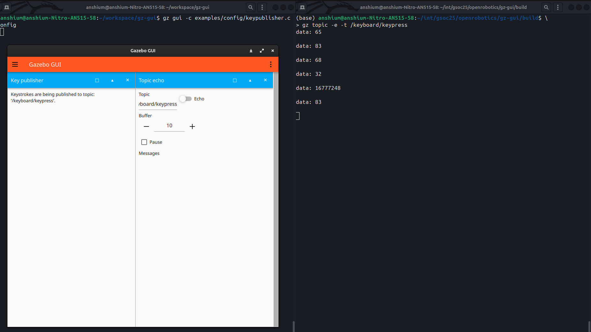

\page plugins Plugins

Next Tutorial: \ref config
Previous Tutorial: \ref commandline

## About Plugins

A Gazebo GUI plugin is a shared library that defines a widget. The plugin contains [QML](http://doc.qt.io/qt-5/qtqml-index.html) code that specifies what the widget looks like, as well as C++ code that defines the plugin's behavior and ties it to other libraries.

## Starting a pre-built plugin (example)

### Step 1: Setting up the environment

If you have built `gz-gui` from source, follow the steps below:

1. Navigate to the directory where gz-gui is present.

```sh
cd ~/workspace/gz-gui
```

2. Set `GZ_GUI_PLUGIN_PATH` environment variable as follows:
```sh
export GZ_GUI_PLUGIN_PATH=$(pwd)
```

To check if GZ_GUI_PLUGIN_PATH was correctly set, do
```sh
echo $GZ_GUI_PLUGIN_PATH
```

### Step 2: Running the Publisher Plugin

1. Run the following command to run the Publisher Plugin. A `gz-gui` window would pop-up.

```sh
gz gui -s Publisher
```


2. Toggle the Publish button.


This makes the Publisher plugin to publish the message `data: "Hello"` on the topic /echo.

### Step 3: Printing the published messages

```sh
gz topic -e -t /echo
```

Here the `topic` command of gz binary is used. In that, we want to echo (`-e`) the data published on the topic (`-t`) called `/echo`.

## Writing Plugins

### Working through an example

We will walk through the HelloPlugin to see how the Plugin is implemented.

We refer to the files [HelloPlugin.hh](https://github.com/gazebosim/gz-gui/blob/main/examples/plugin/hello_plugin/HelloPlugin.hh) and [HelloPlugin.cc](https://github.com/gazebosim/gz-gui/blob/main/examples/plugin/hello_plugin/HelloPlugin.cc) in `examples/plugin/hello_plugin/` in `gz-gui`.

A new plugin should inherit from `gz::gui::Plugin` class.

```cpp
class HelloPlugin : public gz::gui::Plugin
```

The macro `Q_OBJECT` from the Qt framework must be included. This is because the class is a Qt class and it uses Qt features.

We then have the Constructor and the Destructor for `HelloPlugin()`.

```cpp
/// \brief Constructor
public: HelloPlugin();

/// \brief Destructor
public: virtual ~HelloPlugin();
```

### Implementation of the constructor and the destructor.

The constructor simply calls the base class constructor:

```cpp
HelloPlugin::HelloPlugin()
  : gz::gui::Plugin()
{
}
```

The destructor is empty because no cleanup is required as such.

```cpp
HelloPlugin::~HelloPlugin()
{
}
```

### The Configuration File

A plugin may require certain configuration files to specify certain parameter values.

In this case, we would want the configuration file to hold the message to be printed on the display (here the display is the terminal) when the `Hello, Plugin!` button is clicked.

Thus, the [HelloPlugin.config](https://github.com/gazebosim/gz-gui/blob/main/examples/plugin/hello_plugin/HelloPlugin.config) looks like this:

```xml
<plugin filename="HelloPlugin">
  <message>Hello, plugin config!</message>
</plugin>
```

The `LoadConfig` function tries to get the message from the message tag.

```cpp
void HelloPlugin::LoadConfig(const tinyxml2::XMLElement *_pluginElem)
{
  if (!_pluginElem)
    return;

  // Take parameters from XML at runtime
  auto messageElem = _pluginElem->FirstChildElement("message");
  if (nullptr != messageElem && nullptr != messageElem->GetText())
    this->message = messageElem->GetText();
}
```

We have the `OnButton()` function which would print the message when clicked.

```cpp
void HelloPlugin::OnButton()
{
  std::cout << this->message << std::endl;
}
```

Thereafter, `GZ_ADD_PLUGIN` registers the plugin with the Gazebo GUI system, making it discoverable at runtime. Refer to [documentation](https://gazebosim.org/api/plugin/2/gz_2plugin_2Register_8hh.html).

```cpp
GZ_ADD_PLUGIN(HelloPlugin,
              gz::gui::Plugin);
```

## Configuring plugins

As shown above, Gazebo GUI supports loading XML configuration files, which may contain
parameters to be passed directly to the plugin. See the \ref config
tutorial for more information.

## Finding plugins

Gazebo GUI will look for plugins on the following paths, in this order:

1. All paths set on the `GZ_GUI_PLUGIN_PATH` environment variable
2. All paths added by calling `gz::gui::addPluginPath`
3. `~/.gz/gui/plugins`
4. [Plugins which are installed with Gazebo GUI](https://gazebosim.org/api/gui/9/namespacegz_1_1gui_1_1plugins.html)

## More Built-in plugins

### Image Display
Display images from a Gazebo Transport topic.

```sh
gz gui -c examples/config/image.config      
```
or                                                                            
                                                                                  
```sh
gz gui -s ImageDisplay
```


### World stats and control

- Stats: Display sim / real time published on a topic
- Control: Buttons to make play / pause / step service requests                

```sh
gz gui -c examples/config/time.config
```

### Topic echo
                                                                                  
Echo messages from a Gazebo Transport topic.                                    

```sh
gz gui -c examples/config/pubsub.config  
```


In the above image, the `Publisher` publishes `data: "Hello"` to the topic `/echo`. 

The `Topic Echo`  plugin (right) is used to echo the messages. Here it is echoing the messages published on the topic `/echo`.

### Key publisher

Publish key presses through Gazebo Transport.

```sh
gz gui -c examples/config/keypublisher.config
```

Change the topic to echo to `/keyboard/keypress`, echo, and start pressing keys.



In the above image, the keys `A`, `S`, `D`, `Space`, `Super`, `S` were pressed in order. The keycode values are printed on the right terminal.

Additionally, the keycodes can also be viewed on the `Topic Echo` plugin as can be seen below under `Messages`:


